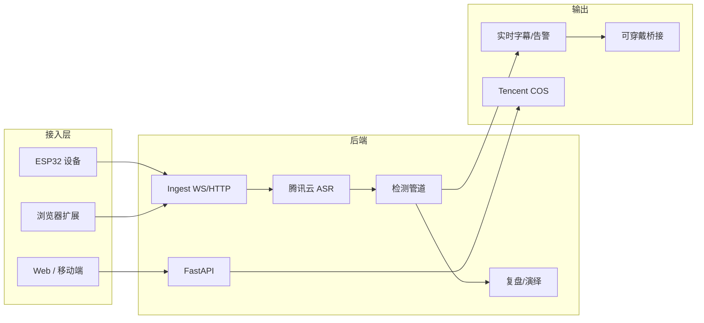

<div align="center">

[](https://infotech-launch.vercel.app/)

**语镜 · Dialog Safety Infra** — 家庭场景下的实时有害语检测与沟通改进平台

[](LICENSE)
[](https://infotech-launch.vercel.app/)
[](https://www.python.org/)
[](https://reactjs.org/)

[官网](https://infotech-launch.vercel.app/) · [功能特性](#功能特性) · [快速开始](#快速开始) · [架构](#系统架构) · [贡献](CONTRIBUTING.md)

</div>

---

## 简介

**Info-Tech 语镜** 面向家庭沟通场景，通过 **实时语音识别 + 有害语检测 + 智能反馈**，帮助家长觉察并改善与孩子的对话方式。支持 ESP32 硬件、Web 端与浏览器扩展多种接入方式，结合 **绝对关键词、语义向量召回与 LLM 筛选** 的三层检测管道，在保证召回的同时控制误报。

| 能力 | 说明 |
|------|------|
| **实时** | WebSocket 音频流 → 腾讯云 ASR → 有害检测 → 振动/字幕提醒 |
| **离线** | 录音文件上传 → 说话人分离 → 复盘摘要与 AI 演绎 |
| **多端** | Web 管理台、实时听写、浏览器扩展、可穿戴桥接（智能眼镜等） |

---

## 产品预览

| 仪表盘 | 官网 |
|--------|------|
|  | [**→ 在线体验官网**](https://infotech-launch.vercel.app/) |

本地运行前端后可访问：**仪表盘** `/dashboard`、**会话列表**、**实时监听** `/live`、**设备管理**、**复盘流** 等完整功能。  
仅需快速查看 UI 风格时，可直接打开仓库根目录 [ui-preview.html](ui-preview.html)（静态预览，无需启动服务）。

---

## 功能特性

### 核心能力

- **实时有害语检测**：绝对关键词（必检）→ 语义向量召回 → LLM 筛选，[详见设计文档](docs/HARMFUL_DETECTION_DESIGN.md)
- **腾讯云 ASR**：实时语音识别 + 录音文件识别，支持说话人分离（最多 9 人）
- **智能反馈**：有害等级 1–5 级，振动强度/实时字幕/告警可配置
- **复盘与演绎**：会话级摘要、关键片段高亮、单句 AI 替代表达与情景演练
- **多端接入**：ESP32（PCM/BLE）、[浏览器扩展](browser-extension/README.md)、[PCM SDK](packages/pcm-client/README.md)、Web 上传

### 技术亮点

|  |  |
|--|--|
| 实时 + 离线双链路 | 实时提醒与事后精确分析并存 |
| 可插拔检测管道 | [关键词 / 向量 / LLM 插件](backend/realtime/README_DETECTORS.md)，可扩展自定义 detector |
| JWT + 设备绑定 | 用户认证与设备归属，支持管理员与普通用户 |
| 腾讯云 COS | 音频存储与预签名 URL，私有读写 |
| 可穿戴桥接 | [字幕/告警桥接方案](docs/WEARABLE_CAPTION_BRIDGE.md)，便于对接智能眼镜等 |

---

## 系统架构



**数据流**：设备/扩展/Web → Ingest → 腾讯云 ASR → 检测管道（关键词 + 向量 + LLM）→ 实时告警 / 存储 / 复盘。

---

## 技术栈

| 层级 | 技术 |
|------|------|
| **后端** | FastAPI · WebSocket · SQLModel · 腾讯云 ASR/COS · OpenRouter（LLM）· JWT |
| **前端** | React 18 · Vite · React Router · 统一设计系统（CSS 变量 + 玻璃态） |
| **检测** | 绝对关键词 · 语义向量（OpenAI Embedding / sentence-transformers）· LLM 筛选 |
| **生态** | 浏览器扩展 · PCM 客户端 SDK · 可穿戴桥接脚本 |

---

## 快速开始

### 环境要求

- **Python 3.10+**（后端）
- **Node.js 18+**（前端）
- 腾讯云账号（ASR + COS，[配置指南](backend/COS_SETUP_GUIDE.md)）

### 1. 克隆与依赖

```bash
git clone https://github.com/Info-Tech-org/info-tech.git
cd info-tech

# 后端
cd backend && pip install -r requirements.txt && cd ..

# 前端
cd frontend && npm install && cd ..
```

### 2. 配置

复制或编辑 `backend/config/settings.py`（或使用 `.env`），至少配置：

- `tencent_secret_id` / `tencent_secret_key`（腾讯云 ASR）
- `tencent_cos_bucket` / `tencent_cos_region`（可选，用于音频存储）
- `openrouter_api_key`（可选，用于 LLM 有害检测与复盘）

### 3. 启动

```bash
# 终端 1：后端
cd backend && python -m uvicorn main:app --host 0.0.0.0 --port 8000 --reload

# 终端 2：前端
cd frontend && npm run dev
```

访问 **http://localhost:3000**（或 Vite 实际端口）。  
首次使用可运行 `python backend/create_admin_user.py` 创建管理员账号。

### 4. 仅看 UI 预览（无需后端）

在仓库根目录双击打开 [ui-preview.html](ui-preview.html)，或运行前端后访问 `/dashboard` 等页面。详见 [docs/UI_PREVIEW.md](docs/UI_PREVIEW.md)。

---

## 项目结构

```
info-tech/
├── backend/              # FastAPI 后端
│   ├── main.py           # 应用入口
│   ├── config/           # 配置（settings.py）
│   ├── api/              # REST：认证、会话、上传、复盘、设备等
│   ├── realtime/         # 实时 ASR、有害检测管道（关键词/向量/LLM）
│   ├── ingest/           # WebSocket 接入、会话管理
│   ├── offline/          # 离线 ASR、说话人分离、COS 上传
│   └── models/           # SQLModel 模型
├── frontend/             # React + Vite 前端
│   └── src/
│       ├── pages/        # 仪表盘、会话、上传、实时监听、设备、复盘流
│       ├── components/  # AppLayout 等
│       └── api/         # fetch 封装
├── assert/               # 官网落地页与品牌资产（Vercel 部署）
├── browser-extension/   # Chrome 扩展（无硬件入口）
├── packages/            # PCM 客户端 SDK 等
├── docs/                # 设计文档、预览说明、架构图
├── tools/               # PCM 测试、可穿戴桥接脚本
└── ui-preview.html      # 静态 UI 预览（免启动）
```

---

## 文档与生态

| 类型 | 链接 |
|------|------|
| **官网与品牌** | [官网](https://infotech-launch.vercel.app/) · [assert/](assert/) · [OFFICIAL_SITE.md](docs/OFFICIAL_SITE.md) |
| **检测设计** | [有害检测方案](docs/HARMFUL_DETECTION_DESIGN.md) · [检测插件说明](backend/realtime/README_DETECTORS.md) |
| **协议与 API** | [PCM 上传](info-tech/docs/PCM_INGEST_API.md) · [WS 流式](info-tech/docs/WS_PCM_STREAMING_PROTOCOL_v1.0.md) · [BLE 绑定](info-tech/docs/BLE_BINDING_PROTOCOL.md) |
| **扩展与 SDK** | [浏览器扩展](browser-extension/README.md) · [PCM 客户端](packages/pcm-client/README.md) · [可穿戴桥接](docs/WEARABLE_CAPTION_BRIDGE.md) |
| **部署与运维** | [部署说明](deploy/README.md) · [COS 配置](backend/COS_SETUP_GUIDE.md) |
| **贡献与规范** | [CONTRIBUTING.md](CONTRIBUTING.md) · [LICENSE](LICENSE) · [SECURITY](SECURITY.md) · [行为准则](CODE_OF_CONDUCT.md) |

---

## 项目规范

本仓库遵循开源与社区协作的常见规范，便于协作与合规使用：

| 文件 | 说明 |
|------|------|
| [**LICENSE**](LICENSE) | MIT 许可证，允许使用、修改与再分发，需保留版权声明 |
| [**SECURITY.md**](SECURITY.md) | 安全政策：支持版本、漏洞报告方式（私密）、非安全问题的反馈渠道 |
| [**CODE_OF_CONDUCT.md**](CODE_OF_CONDUCT.md) | 行为准则：社区参与标准、不可接受行为、举报方式（基于 Contributor Covenant 2.0） |
| [**CONTRIBUTING.md**](CONTRIBUTING.md) | 贡献指南：Bug 报告、功能建议、提交流程与代码规范 |

对外分发或二次开发时请遵守 [LICENSE](LICENSE)；参与贡献前请阅读 [CONTRIBUTING.md](CONTRIBUTING.md) 与 [CODE_OF_CONDUCT.md](CODE_OF_CONDUCT.md)。

---

## 贡献与许可证

欢迎通过 [GitHub Issues](https://github.com/Info-Tech-org/info-tech/issues) 反馈问题，通过 [Pull Request](https://github.com/Info-Tech-org/info-tech/compare) 提交改进。请先阅读 [CONTRIBUTING.md](CONTRIBUTING.md) 与 [CODE_OF_CONDUCT.md](CODE_OF_CONDUCT.md)。

本项目采用 [MIT License](LICENSE)。安全相关问题请按 [SECURITY.md](SECURITY.md) 私密报告。

---

<div align="center">

**语镜** — 让家庭对话更安心 · [https://infotech-launch.vercel.app/](https://infotech-launch.vercel.app/)

</div>
