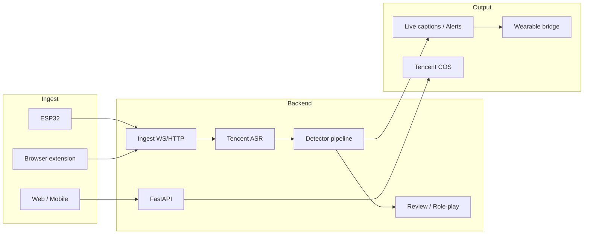

<div align="center">

<div style="background:#2b2a24;padding:16px 24px;border-radius:12px;display:inline-block;margin-bottom:8px;">
  <a href="https://infotech-launch.vercel.app/"></a>
</div>

**Dialog-OS · Dialog Safety Infra** — Real-time harmful-speech detection and communication improvement for family dialogue

*Primary documentation is in English. 中文简要说明：[README_zh.md](README_zh.md).*

[](LICENSE)
[](https://infotech-launch.vercel.app/)
[](https://www.python.org/)
[](https://reactjs.org/)

[Website](https://infotech-launch.vercel.app/) · [Features](#features) · [Quick Start](#quick-start) · [Architecture](#architecture) · [Contributing](CONTRIBUTING.md)

</div>

---

## Introduction

**Dialog-OS** (语镜) targets family conversation: **real-time speech recognition + harmful-speech detection + smart feedback** so parents can notice and improve how they talk to children. It supports ESP32 hardware, web, and browser extension; uses a three-stage pipeline (**absolute keywords → semantic vector recall → LLM screening**) for high recall with controlled false positives.

| Capability | Description |
|------------|-------------|
| **Real-time** | WebSocket audio → Tencent Cloud ASR → harmful detection → vibration/caption alerts |
| **Offline** | Upload recordings → speaker diarization → replay summary and AI role-play |
| **Multi-client** | Web dashboard, live captioning, browser extension, wearable bridge (e.g. smart glasses) |

---

## Product Preview

| Dashboard | Website |
|-----------|---------|
|  | [**→ Live website**](https://infotech-launch.vercel.app/) |

Run the frontend locally for full **Dashboard** `/dashboard`, **Sessions**, **Live Listen** `/live`, **Devices**, **Review Feed**, etc. For a quick UI-only preview, open [ui-preview.html](ui-preview.html) in the repo root (no server required). See [docs/UI_PREVIEW.md](docs/UI_PREVIEW.md).

---

## Features

### Core

- **Real-time harmful-speech detection**: absolute keywords → semantic vector recall → LLM screening. [Design doc](docs/HARMFUL_DETECTION_DESIGN.md)
- **Tencent Cloud ASR**: real-time and file-based recognition, speaker diarization (up to 9 speakers)
- **Smart feedback**: severity 1–5, configurable vibration, live captions, alerts
- **Review & role-play**: session summaries, highlight clips, AI alternative phrasing and scenario practice
- **Multi-client**: ESP32 (PCM/BLE), [browser extension](browser-extension/README.md), [PCM SDK](packages/pcm-client/README.md), web upload

### Tech highlights

| | |
|--|--|
| Real-time + offline | Live alerts and post-hoc analysis |
| Pluggable detectors | [Keyword / vector / LLM](backend/realtime/README_DETECTORS.md), extensible |
| JWT + device binding | User auth and device ownership, admin and normal users |
| Tencent COS | Audio storage and presigned URLs, private read/write |
| Wearable bridge | [Caption/alert bridge](docs/WEARABLE_CAPTION_BRIDGE.md) for smart glasses, etc. |

---

## Architecture



**Flow**: Devices / extension / web → Ingest → Tencent ASR → pipeline (keywords + vectors + LLM) → live alerts / storage / review.

---

## Tech Stack

| Layer | Stack |
|-------|--------|
| **Backend** | FastAPI · WebSocket · SQLModel · Tencent ASR/COS · OpenRouter (LLM) · JWT |
| **Frontend** | React 18 · Vite · React Router · design system (CSS variables, glassmorphism) |
| **Detection** | Absolute keywords · semantic vectors (OpenAI / sentence-transformers) · LLM screening |
| **Ecosystem** | Browser extension · PCM client SDK · wearable bridge scripts |

---

## Quick Start

### Requirements

- **Python 3.10+** (backend)
- **Node.js 18+** (frontend)
- Tencent Cloud account (ASR + COS). [Setup guide](backend/COS_SETUP_GUIDE.md)

### 1. Clone and install

```bash
git clone https://github.com/Info-Tech-org/Dialog-OS.git
cd Dialog-OS

# Backend
cd backend && pip install -r requirements.txt && cd ..

# Frontend
cd frontend && npm install && cd ..
```

### 2. Configure (local only)

Secrets stay out of the repo. Use a local `.env` in `backend/`:

```bash
cd backend
cp .env.example .env
# Edit .env and set TENCENT_SECRET_ID, TENCENT_SECRET_KEY, OPENROUTER_API_KEY, etc.
```

Or run the one-shot setup script (prompts for keys and writes `backend/.env`):

```bash
python scripts/setup_local_env.py
```

See [Local development](#local-development-secrets) below.

### 3. Run

```bash
# Terminal 1: backend
cd backend && python -m uvicorn main:app --host 0.0.0.0 --port 8000 --reload

# Terminal 2: frontend
cd frontend && npm run dev
```

Open **http://localhost:3000** (or the port Vite shows). Create an admin with `python backend/create_admin_user.py` if needed.

### 4. UI-only preview

Open [ui-preview.html](ui-preview.html) in the repo root, or run the frontend and go to `/dashboard`. [docs/UI_PREVIEW.md](docs/UI_PREVIEW.md).

---

## Local development (secrets)

All secrets are read from **environment variables** (e.g. `backend/.env`). Never commit real keys.

1. **Copy template**: `cp backend/.env.example backend/.env`
2. **Fill in** `backend/.env` with your Tencent ASR/COS and OpenRouter keys.
3. **One-shot script** (optional): from repo root run `python scripts/setup_local_env.py`; it will prompt for each key and write `backend/.env`.

Required for full local run:

- `TENCENT_SECRET_ID`, `TENCENT_SECRET_KEY` (Tencent Cloud ASR)
- `OPENROUTER_API_KEY` (LLM for harmful detection and review)
- Optional: COS bucket/region, `EMBEDDING_*` for vector detection, `JWT_SECRET_KEY`

---

## Project structure

```
Dialog-OS/
├── backend/           # FastAPI backend
│   ├── main.py        # App entry
│   ├── config/        # settings.py (env-based)
│   ├── api/           # REST: auth, sessions, upload, review, devices
│   ├── realtime/      # ASR, detector pipeline (keyword / vector / LLM)
│   ├── ingest/        # WebSocket ingest, session management
│   ├── offline/       # Offline ASR, diarization, COS upload
│   └── models/        # SQLModel
├── frontend/          # React + Vite
│   └── src/
│       ├── pages/     # Dashboard, sessions, upload, live, devices, review
│       ├── components/
│       └── api/
├── assert/            # Website and brand assets (e.g. Vercel)
├── browser-extension/
├── packages/           # PCM client SDK, etc.
├── docs/              # Design docs, UI preview
├── tools/             # PCM tests, wearable bridge
└── ui-preview.html    # Static UI preview (no server)
```

---

## Docs and ecosystem

| Type | Links |
|------|------|
| **Website** | [Website](https://infotech-launch.vercel.app/) · [assert/](assert/) · [OFFICIAL_SITE.md](docs/OFFICIAL_SITE.md) |
| **Detection** | [Harmful detection design](docs/HARMFUL_DETECTION_DESIGN.md) · [Detector plugins](backend/realtime/README_DETECTORS.md) |
| **APIs** | [PCM ingest](info-tech/docs/PCM_INGEST_API.md) · [WS streaming](info-tech/docs/WS_PCM_STREAMING_PROTOCOL_v1.0.md) · [BLE binding](info-tech/docs/BLE_BINDING_PROTOCOL.md) |
| **Extensions** | [Browser extension](browser-extension/README.md) · [PCM client](packages/pcm-client/README.md) · [Wearable bridge](docs/WEARABLE_CAPTION_BRIDGE.md) |
| **Deploy** | [Deploy guide](deploy/README.md) · [COS setup](backend/COS_SETUP_GUIDE.md) |
| **Governance** | [CONTRIBUTING.md](CONTRIBUTING.md) · [LICENSE](LICENSE) · [SECURITY](SECURITY.md) · [CODE_OF_CONDUCT](CODE_OF_CONDUCT.md) |

---

## Project standards

| File | Purpose |
|------|---------|
| [**LICENSE**](LICENSE) | MIT. Use, modify, redistribute with copyright notice. |
| [**SECURITY.md**](SECURITY.md) | Supported versions, how to report vulnerabilities privately. |
| [**CODE_OF_CONDUCT.md**](CODE_OF_CONDUCT.md) | Community standards (Contributor Covenant 2.0). |
| [**CONTRIBUTING.md**](CONTRIBUTING.md) | Bug reports, feature ideas, PR and code guidelines. |

---

## Contributing and license

Use [GitHub Issues](https://github.com/Info-Tech-org/Dialog-OS/issues) for bugs and [Pull Requests](https://github.com/Info-Tech-org/Dialog-OS/compare) for changes. Please read [CONTRIBUTING.md](CONTRIBUTING.md) and [CODE_OF_CONDUCT.md](CODE_OF_CONDUCT.md).

This project is [MIT licensed](LICENSE). Security issues: see [SECURITY.md](SECURITY.md).

---

<div align="center">

**Dialog-OS** — Safer family dialogue · [https://infotech-launch.vercel.app/](https://infotech-launch.vercel.app/)

</div>
